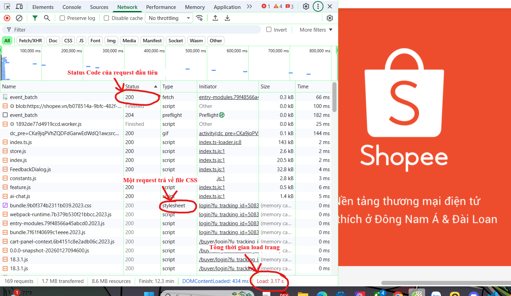
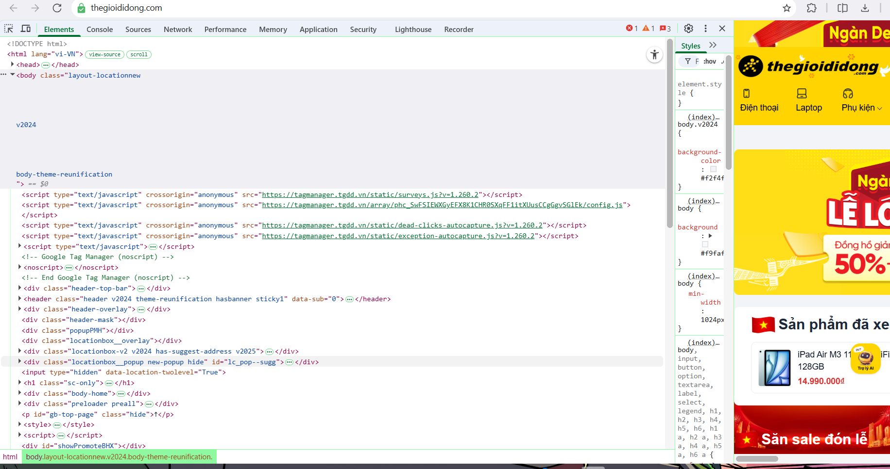
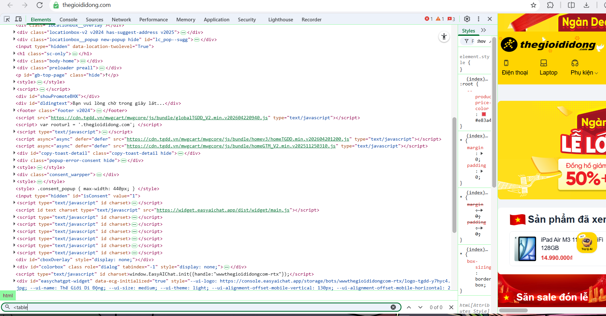
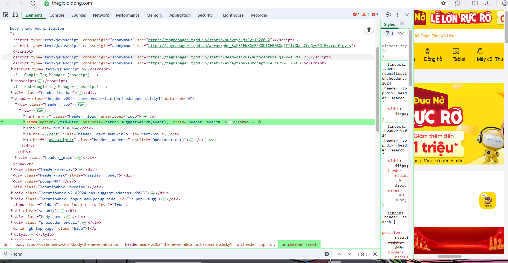

## Câu A1 — HTTP & Browser

### 1. Trình tự các bước khi gõ https://shopee.vn và nhấn Enter

*Nguồn: Chương 01 — Phần 0,2,3*

Dựa trên quy trình hoạt động của Web, dưới đây là 5 bước chính theo đúng thứ tự:

- **Bước 1 – DNS Lookup & Request:**  
  Trình duyệt phân giải tên miền thành địa chỉ IP. Sau đó gửi HTTP Request từ thiết bị qua mạng Internet đến server.

- **Bước 2 – Server xử lý & Response:**  
  Server nhận request, xử lý và trả về HTTP Response (ví dụ: `200 OK`) kèm các file HTML, CSS, JS.

- **Bước 3 – Parse HTML & CSS:**  
  Trình duyệt phân tích HTML để tạo DOM Tree và CSS để tạo CSSOM Tree.

- **Bước 4 – Thực thi JavaScript:**  
  JavaScript được chạy để xử lý logic và có thể thay đổi DOM/CSS.

- **Bước 5 – Render (Layout & Paint):**  
  Trình duyệt tính toán layout và vẽ giao diện hoàn chỉnh lên màn hình.

### 2. Tab Network trong DevTools cho thấy thông tin gì?

*Nguồn: Chương 01 — Phần 2, Phần 3*

Tab **Network** hiển thị toàn bộ hoạt động giao tiếp giữa Client và Server, bao gồm:

- Danh sách tất cả HTTP Request và Response
- Các tài nguyên được tải (HTML, CSS, JS, hình ảnh, font…)
- Phương thức HTTP (GET, POST, PUT, DELETE)
- HTTP Status Code (200, 404, 500…)
- Thời gian tải và dung lượng của từng request


Hình: Minh họa tab Network trong trình duyệt

---

## Câu A2 — Semantic HTML

### 1. Tại sao trang web bị Google đánh giá SEO thấp?

*(Nguồn: Chương 04 — Phần 1, Phần 3)*
Trang web trên mắc lỗi **"Div Soup"** (lạm dụng thẻ `<div>`). Thẻ `<div>` là thẻ không mang ý nghĩa ngữ nghĩa, khiến Google và trình đọc màn hình không thể hiểu cấu trúc trang (header, menu, nội dung chính, footer), dẫn đến SEO và Accessibility kém.

=> Việc sử dụng Semantic HTML giúp công cụ tìm kiếm hiểu rõ cấu trúc trang, từ đó cải thiện SEO và khả năng truy cập.

### 2. Liệt kê 4 lỗi semantic cụ thể:

- **Lỗi 1 (Layout):** Dùng `<div>` thay cho `<header>`, `<main>`, `<footer>`
- **Lỗi 2:** Không dùng `<nav>` cho menu điều hướng
- **Lỗi 3:** Không dùng `<article>` và thẻ heading (`<h1>`) cho sản phẩm
- **Lỗi 4:** Ảnh thiếu thuộc tính `alt`

### 3. Code HTML sửa lại chuẩn Semantic:**
```html
<header>
    <div class="logo">ShopTLU</div>

    <nav class="menu">
        <ul>
            <li><a href="/">Trang chủ</a></li>
            <li><a href="/products">Sản phẩm</a></li>
        </ul>
    </nav>
</header>

<main>
    <article class="product">
        <h1 class="title">iPhone 16 Pro</h1>
        <p class="price">25.990.000đ</p>

        <figure class="image">
            
        </figure>
    </article>
</main>

<footer>
    <p>© 2026 ShopTLU</p>
</footer>
```    
---

## Câu A3 — Block vs Inline

### 1. Kết quả hiển thị (Text Art)
```txt
+------------------------+
| Hộp 1                  |
+------------------------+

Text A Text B

+------------------------+
| Hộp 2                  |
+------------------------+

Text C Text D

+------------------------+
| Hộp 3                  |
+------------------------+
```
### 2. Giải thích

Kết quả hiển thị trên bị chi phối bởi tính chất hiển thị mặc định của các thẻ HTML (Block-level và Inline-level):

**`<div>` là phần tử Block-level (khối):**  
  Các thẻ `<div>Hộp 1</div>`, `<div>Hộp 2</div>`, và `<div>Hộp 3</div>` mặc định chiếm 100% chiều rộng của phần tử cha.  
  Do đó, mỗi khi xuất hiện `<div>`, trình duyệt sẽ tự động ngắt dòng trước và sau nó.

**`<span>` là phần tử Inline-level (nội dòng):**  
  Các thẻ `<span>Text A</span>`, `<span>Text B</span>`, `<span>Text C</span>` chỉ chiếm không gian vừa đủ với nội dung.  
  Chúng không tạo dòng mới mà sẽ nằm nối tiếp nhau trên cùng một dòng.

**`<strong>` cũng là phần tử Inline-level:**  
  Thẻ `<strong>Text D</strong>` hoạt động giống `<span>` về bố cục, nhưng có thêm định dạng in đậm.  
  Nó nằm cùng dòng với "Text C".

---

## Câu A4 — Table
### 1. Sự khác nhau giữa `<thead>`, `<tbody>`, `<tfoot>`

*Nguồn: Chương 05 — Phần 3, 8*

Ba thẻ này được dùng để phân chia cấu trúc ngữ nghĩa của một bảng dữ liệu:

- **`<thead>` (Table Head):**  
  Phần đầu bảng, chứa các hàng tiêu đề cột (thường dùng `<th>`). Trình duyệt thường hiển thị nội dung in đậm và căn giữa.

- **`<tbody>` (Table Body):**  
  Phần thân bảng, chứa toàn bộ dữ liệu chính. Một bảng có thể có nhiều `<tbody>` để nhóm dữ liệu.

- **`<tfoot>` (Table Foot):**  
  Phần chân bảng, thường chứa tổng kết hoặc ghi chú cho dữ liệu phía trên.

**Lợi ích kỹ thuật:**  
Giúp Screen Reader đọc bảng chính xác hơn. Trình duyệt có thể render `<tfoot>` sớm ngay cả khi `<tbody>` chưa tải xong. Ngoài ra, CSS dễ dàng áp dụng style riêng cho từng phần.

### 2. Tại sao KHÔNG NÊN dùng table để tạo layout trang web?

*Nguồn: Chương 05 — Phần 0, 1, 5, 7*

1. **Sai ngữ nghĩa & ảnh hưởng Accessibility:**  
   `<table>` chỉ dùng cho dữ liệu dạng bảng. Nếu dùng để layout, Google sẽ hiểu sai nội dung, còn Screen Reader sẽ đọc trang như bảng dữ liệu → rất khó sử dụng.

2. **Khó bảo trì & không responsive:**  
   Layout bằng table rất cứng nhắc, khó hiển thị tốt trên mobile.  
   Giải pháp hiện đại là dùng **Flexbox** hoặc **Grid**.

3. **Gây xung đột với chức năng bảng:**  
   Khi cần dùng các tính năng như sort, resize cột…, việc dùng table cho layout sẽ làm giao diện dễ bị lỗi hoặc vỡ cấu trúc

---

## Bài B3 — Debug HTML

Danh sách 11 lỗi (Syntax và Semantic) được tìm thấy:

**Lỗi 1: Dòng 1** — Khai báo DOCTYPE sai cú pháp (thiếu chữ `html`). — *Cách sửa:* Sửa `<!DOCTYPE>` thành `<!DOCTYPE html>`.

**Lỗi 2: Dòng 2** — Thẻ `<title>` chưa được đóng. — *Cách sửa:* Thêm thẻ đóng thành `<title>Trang web</title>`.

**Lỗi 3: Dòng 3** — Thuộc tính charset viết sai chuẩn (thiếu dấu gạch ngang). — *Cách sửa:* Sửa `"utf8"` thành `"UTF-8"`.

**Lỗi 4: Dòng 5** — Thẻ đóng heading sai cú pháp (thiếu dấu `/`). — *Cách sửa:* Sửa `<h1>` ở cuối câu thành `</h1>`. Ngoài ra, `<header>` nên bao bọc luôn thẻ `<h1>` này.

**Lỗi 5: Dòng 9** — Thẻ đóng hyperlink sai cú pháp (thiếu dấu `/`). — *Cách sửa:* Sửa `<a>` ở cuối dòng thành `</a>`.

**Lỗi 6: Dòng 16** — Lỗi semantic về phân cấp Heading (nhảy cóc từ `<h1>` xuống `<h3>` bỏ qua `<h2>`). — *Cách sửa:* Đổi thẻ `<h3>` thành `<h2>`.

**Lỗi 7: Dòng 17** — Thuộc tính `src` thiếu dấu ngoặc kép và thẻ `` thiếu thuộc tính bắt buộc `alt`. — *Cách sửa:* Sửa thành ``.

**Lỗi 8: Dòng 19** — Lỗi syntax về chồng chéo thẻ (thẻ `<b>` mở bên trong `<p>` nhưng lại đóng bên ngoài). — *Cách sửa:* Đảo lại thứ tự thẻ đóng và thay `<b>` bằng `<strong>` cho chuẩn semantic: `<p>Giá: <strong>25.990.000đ</strong></p>`.

**Lỗi 9: Dòng 26, 27** — Lỗi semantic ở tiêu đề bảng (dùng thẻ dữ liệu `<td>` thay vì thẻ tiêu đề `<th>`). — *Cách sửa:* Đổi `<td` thành `<th`. (Và nên bọc thêm `<thead>`, `<tbody>`).

**Lỗi 10: Dòng 37** — Lỗi semantic nghiêm trọng: Một trang web chỉ được phép có duy nhất 1 thẻ `<main>` hoạt động. Đồng thời nội dung là "Sidebar" thì nên dùng thẻ khác. — *Cách sửa:* Đổi thẻ `<main>` thứ hai thành thẻ `<aside>`.

**Lỗi 11: Dòng 42** — Thẻ đoạn văn `<p>` bị thiếu thẻ đóng. — *Cách sửa:* Thêm thẻ đóng thành `<p>Copyright 2026</p>`.

---

## Bài B4 — Phân tích trang web thật

**Trang web chọn:** `thegioididong.com`

### 1. Phân tích thẻ Semantic HTML5
*(Ảnh minh họa tab Elements trên trang chủ Thế Giới Di Động)*


**3 thẻ semantic mà trang sử dụng (Rất tốt):**
1. **`<header>`**: Bao bọc toàn bộ khu vực đầu trang chứa Logo, Thanh tìm kiếm và Menu địa chỉ.
2. **`<footer>`**: Nằm ở dưới đáy trang web, chứa các thông tin liên kết như "Tích điểm Quà tặng VIP", "Lịch sử mua hàng", "Chính sách bảo hành".
3. **`<section>`**: Sử dụng để chia bố cục các khu vực lớn ở trang chủ như khu vực khuyến mãi "Tuần lễ Apple" hay "Điện thoại nổi bật".

**2 thẻ mà trang sử dụng CHƯA chuẩn Semantic (Lỗi Div Soup):**
1. **Thẻ sản phẩm dùng `<div>`**: Mỗi chiếc điện thoại trong danh sách là một thành phần độc lập (có tên, giá, ảnh), đáng lẽ nên được bọc bằng thẻ `<article>`, nhưng trang lại bọc bằng các thẻ `<li>` hoặc `<div>` (như `<div class="item">`).
2. **Menu phụ không dùng `<nav>`**: Một số cụm menu hoặc danh mục bên dưới dùng cấu trúc `<div class="menu">` thay vì sử dụng thẻ chuyên dụng `<nav>`.

### 2. Phân tích thẻ `<table>` (Sự vắng mặt của thẻ Table)
*(Ảnh chụp tab Elements trên trang chủ Thế Giới Di Động)*

- **Table đó hiển thị nội dung gì?** Em đã kiểm tra phần "Cấu hình điện thoại" (hoặc Thông số kỹ thuật) - nơi đúng ra phải sử dụng cấu trúc bảng.
- **Có dùng `<thead>`, `<tbody>` không?** - **KHÔNG.** Thực tế là trang web này **không hề sử dụng thẻ `<table>`** nào cho phần dữ liệu dạng bảng (Tabular data) của họ. 
  - Thay vào đó, họ lạm dụng các thẻ `<ul>, <li>` hoặc các thẻ `<div>` (ví dụ: `<div class="parameter">` hoặc `<ul class="parameter">`) kết hợp với CSS để dàn trang trông giống như một cái bảng.
  - **Đánh giá Semantic:** Đây chính là lỗi **"Div Soup" (Anti-pattern)** điển hình được nhắc đến trong lý thuyết. Việc không dùng thẻ `<table>` cho dữ liệu bảng khiến cấu trúc mất đi ý nghĩa (Semantic)


### 3. Phân tích thẻ `<form>`
*(Ảnh chụp tab Elements trên trang chủ Thế Giới Di Động)*


- **Form đó là gì?** Đây là Form tìm kiếm sản phẩm nằm ở Header.
- **Action và Method:**
  - **`action`**: Thuộc tính này thường được đặt là URL trang kết quả tìm kiếm (Ví dụ: `action="/tim-kiem"`). Khi submit form, nó sẽ đưa người dùng đến trang này.
  - **`method`**: Sử dụng method `GET`. (Vì thao tác tìm kiếm chỉ là lấy dữ liệu từ Server về để xem, từ khóa sẽ được đẩy lên thẳng thanh URL, ví dụ: `?key=iphone`).
- **Input types được dùng:**
  - **`<input type="text">`**: Đây là ô nhập liệu chính để người dùng gõ từ khóa tìm kiếm (Placeholder: "Bạn tìm gì...").

  ---

## Bài C1 — Thiết kế cấu trúc
```html
<!DOCTYPE html>
<html lang="vi">
<head>
    <meta charset="UTF-8">
    <meta name="viewport" content="width=device-width, initial-scale=1.0">
    <title>Chi tiết sản phẩm - iPhone 16</title>
</head>
<body>

    <!-- HEADER + NAVIGATION -->
    <!-- Dùng header vì là phần đầu trang, chứa logo và menu điều hướng chính -->
    <header>
        <!-- nav vì đây là menu điều hướng chính của trang -->
        <nav aria-label="Menu chính">
            <ul>
                <li><a href="/">Trang chủ</a></li>
                <li><a href="/products">Sản phẩm</a></li>
                <li><a href="/cart">Giỏ hàng</a></li>
            </ul>
        </nav>
    </header>

    <!-- MAIN CONTENT -->
    <!-- main vì đây là nội dung chính của trang -->
    <main>

        <!-- BREADCRUMB -->
        <!-- nav vì đây là điều hướng cho phép user di chuyển giữa các trang -->
        <nav aria-label="breadcrumb">
            <!-- ol vì breadcrumb có thứ tự từ trang cha đến trang con -->
            <ol>
                <li><a href="/">Trang chủ</a></li>
                <li><a href="/dien-thoai">Điện thoại</a></li>
                <li><a href="/iphone">iPhone</a></li>
                <li><a href="/iphone-16">iPhone 16</a></li>
            </ol>
        </nav>

        <!-- KHU VỰC ẢNH SẢN PHẨM -->
        <!-- section vì đây là một khu vực nội dung độc lập -->
        <section id="product-images">
            <!-- figure vì chứa ảnh minh họa sản phẩm -->
            <figure>
                <!-- img chính hiển thị ảnh sản phẩm lớn -->
                
                <!-- figcaption mô tả ảnh -->
                <figcaption>iPhone 16 Pro Max - 256GB</figcaption>
            </figure>
            
            <!-- thumbnail list - dùng ul vì là danh sách ảnh nhỏ -->
            <ul class="thumbnail-list">
                <li></li>
                <li></li>
                <li></li>
                <li></li>
                <li></li>
            </ul>
        </section>

        <!-- THÔNG TIN SẢN PHẨM -->
        <!-- article vì đây là nội dung độc lập về sản phẩm -->
        <article id="product-info">
            <!-- h1 vì đây là tiêu đề chính của trang -->
            <h1>iPhone 16 Pro Max 256GB</h1>
            
            <!-- div cho khu vực đánh giá (không có semantic phù hợp hơn) -->
            <div class="rating">
                <!-- span vì là text inline, không ngắt dòng -->
                <span class="stars">★★★★★</span>
                <span class="review-count">(1.234 đánh giá)</span>
            </div>
            
            <!-- price - dùng p vì là đoạn văn bản -->
            <p class="price">
                <!-- strong vì giá là thông tin quan trọng cần nhấn mạnh -->
                <strong>25.990.000 ₫</strong>
            </p>
            
            <!-- mô tả sản phẩm -->
            <p class="description">
                iPhone 16 Pro Max với thiết kế sang trọng, màn hình Super Retina XDR 6.9 inch, 
                chip A18 Pro mạnh mẽ, camera 48MP chụp ảnh đỉnh cao.
            </p>
        </article>

        <!-- BẢNG THÔNG SỐ KỸ THUẬT -->
        <!-- section vì là một khu vực nội dung riêng biệt -->
        <section id="specifications">
            <h2>Thông số kỹ thuật</h2>
            
            <!-- table vì đây là dữ liệu dạng bảng (tabular data) -->
            <table>
                <!-- thead vì đây là phần tiêu đề của bảng -->
                <thead>
                    <tr>
                        <th scope="col">Thông số</th>
                        <th scope="col">Chi tiết</th>
                    </tr>
                </thead>
                
                <!-- tbody vì đây là phần thân chứa dữ liệu chính -->
                <tbody>
                    <tr>
                        <td>Màn hình</td>
                        <td>6.9 inch Super Retina XDR</td>
                    </tr>
                    <tr>
                        <td>Chip</td>
                        <td>A18 Pro</td>
                    </tr>
                    <tr>
                        <td>RAM</td>
                        <td>8GB</td>
                    </tr>
                    <tr>
                        <td>Bộ nhớ trong</td>
                        <td>256GB</td>
                    </tr>
                    <tr>
                        <td>Camera</td>
                        <td>48MP + 12MP + 12MP</td>
                    </tr>
                    <tr>
                        <td>Pin</td>
                        <td>4685 mAh</td>
                    </tr>
                </tbody>
            </table>
        </section>

        <!-- KHU VỰC ĐÁNH GIÁ / BÌNH LUẬN -->
        <!-- section vì là một khu vực nội dung riêng biệt -->
        <section id="reviews">
            <h2>Đánh giá sản phẩm</h2>
            
            <!-- article cho mỗi đánh giá riêng biệt -->
            <article class="review-item">
                <!-- header của review chứa tên user và ngày -->
                <header>
                    <h3>Nguyễn Văn A</h3>
                    <time datetime="2026-04-24">24/04/2026</time>
                </header>
                
                <!-- div cho đánh giá sao (không có semantic phù hợp) -->
                <div class="review-rating">★★★★★</div>
                
                <!-- p cho nội dung bình luận -->
                <p>Sản phẩm rất tốt, giao hàng nhanh, đóng gói cẩn thận.</p>
            </article>
            
            <!-- article cho đánh giá thứ 2 -->
            <article class="review-item">
                <header>
                    <h3>Trần Thị B</h3>
                    <time datetime="2026-04-23">23/04/2026</time>
                </header>
                <div class="review-rating">★★★★☆</div>
                <p>Máy đẹp, chụp ảnh xuất sắc. Còn hơi đắt nhưng worth it.</p>
            </article>
        </section>

    </main>

    <!-- SIDEBAR: SẢN PHẨM TƯƠNG TỰ -->
    <!-- aside vì đây là nội dung phụ, bổ sung cho main content -->
    <aside id="related-products">
        <h2>Sản phẩm tương tự</h2>
        
        <!-- article cho mỗi sản phẩm trong sidebar -->
        <article class="related-product">
            <a href="/iphone-16">
                
                <h3>iPhone 16</h3>
                <p><strong>22.990.000 ₫</strong></p>
            </a>
        </article>
        
        <article class="related-product">
            <a href="/iphone-15">
                
                <h3>iPhone 15</h3>
                <p><strong>18.990.000 ₫</strong></p>
            </a>
        </article>
        
        <article class="related-product">
            <a href="/samsung-s24">
                
                <h3>Samsung S24 Ultra</h3>
                <p><strong>28.990.000 ₫</strong></p>
            </a>
        </article>
    </aside>

    <!-- FOOTER -->
    <!-- footer vì đây là phần chân trang -->
    <footer>
        <!-- nav vì chứa các link điều hướng -->
        <nav aria-label="Menu footer">
            <ul>
                <li><a href="/chinh-sach">Chính sách bảo hành</a></li>
                <li><a href="/chinh-sach-doitra">Chính sách đổi trả</a></li>
                <li><a href="/lien-he">Liên hệ</a></li>
                <li><a href="/faq">FAQ</a></li>
            </ul>
        </nav>
        
        <!-- p cho text copyright -->
        <p>&copy; 2026 Shop Công Nghệ. Tất cả các quyền được bảo lưu.</p>
    </footer>

</body>
</html>
```
---

## Bài C2 (10đ) — So sánh & Tranh luận: Phản biện về "Div Soup"

Chào đồng nghiệp, việc dùng toàn `<div>` kết hợp class quả thực vẫn tạo ra được một giao diện hiển thị đúng ý muốn, nhưng đó chỉ là "bề nổi" của web. Việc bỏ qua Semantic HTML sẽ mang lại những hậu quả nghiêm trọng về mặt kỹ thuật dưới "tảng băng chìm":

**Thứ nhất, về SEO (Tối ưu hóa công cụ tìm kiếm):** Các bot của Google (Crawler) không "nhìn" trang web như con người mà "đọc" mã nguồn. Chúng không hiểu `<div class="title">` là gì, nhưng chúng biết `<h1>` là tiêu đề quan trọng nhất, hoặc `<article>` chứa nội dung độc lập. Việc dùng toàn `<div>` khiến bot không thể bóc tách được cấu trúc trang, dẫn đến việc trang web bị đánh giá thấp và rớt hạng nghiêm trọng trên kết quả tìm kiếm.

**Thứ hai, về Accessibility (Khả năng tiếp cận):** Những người khiếm thị sử dụng trình đọc màn hình (Screen Reader) để lướt web. Phần mềm này dùng các thẻ như `<nav>`, `<main>` làm các "điểm neo" (landmarks) để người dùng dễ dàng bỏ qua menu và nhảy thẳng đến nội dung chính. Nếu trang chỉ toàn `<div>`, trình đọc màn hình sẽ coi đó là một mớ văn bản phẳng không cấu trúc, bắt người khiếm thị phải nghe đọc từ đầu đến cuối một cách cực hình.

**Ví dụ cụ thể chứng minh:** Thử so sánh một `<button>Gửi</button>` và một `<div class="btn">Gửi</div>`. Thẻ `<button>` được trình duyệt mặc định hỗ trợ dùng phím Tab để focus và phím Enter/Space để bấm. Nếu dùng thẻ `<div>`, nó chỉ là một cái hộp vô tri; bạn sẽ phải viết thêm rất nhiều dòng CSS và JavaScript chỉ để "mô phỏng" lại những chức năng cơ bản đã có sẵn của thẻ button. Học Semantic HTML thực chất là để tiết kiệm thời gian code!

**Trường hợp thực tế `<div>` vẫn phù hợp:** Thẻ `<div>` hoàn toàn không có tội nếu dùng đúng chỗ. Nó cực kỳ phù hợp khi đóng vai trò là một "wrapper" (vỏ bọc) thuần túy để chia bố cục layout. Ví dụ: Dùng `<div class="flex-container">` bọc ngoài các `<article>` để sử dụng CSS Flexbox dàn chúng thành các cột ngang. Ở đây, khối container đó không mang ý nghĩa ngữ nghĩa nào về mặt nội dung, nên dùng `<div>` là lựa chọn chính xác nhất.