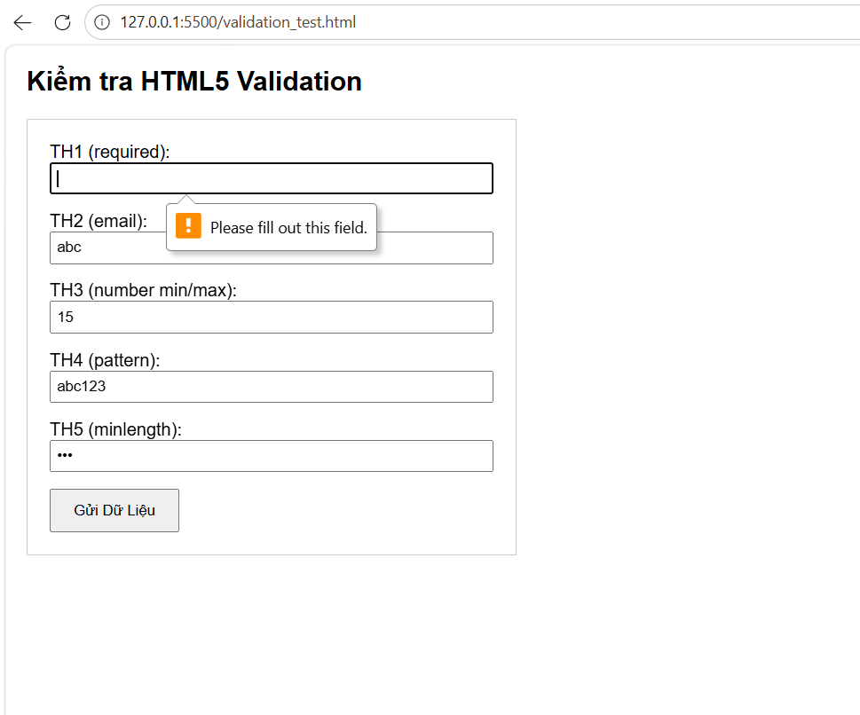
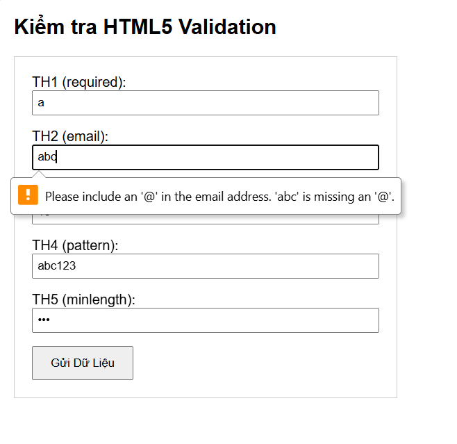
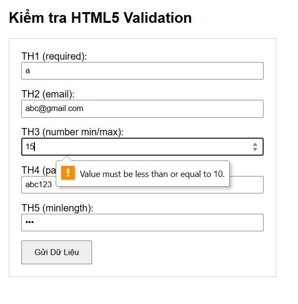
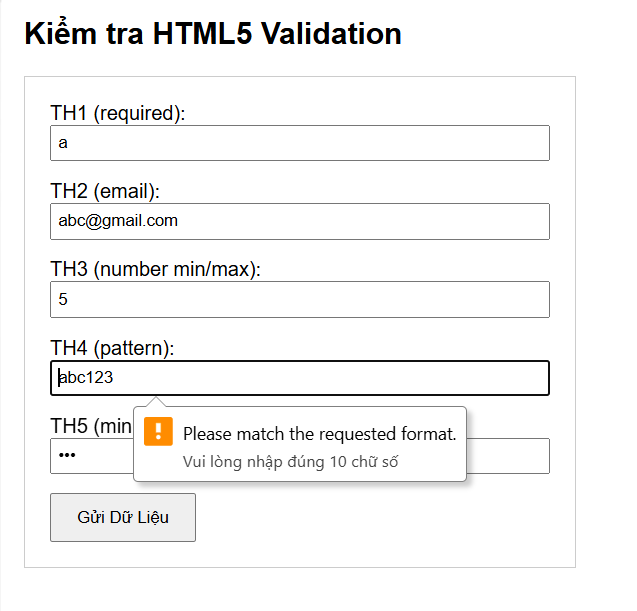
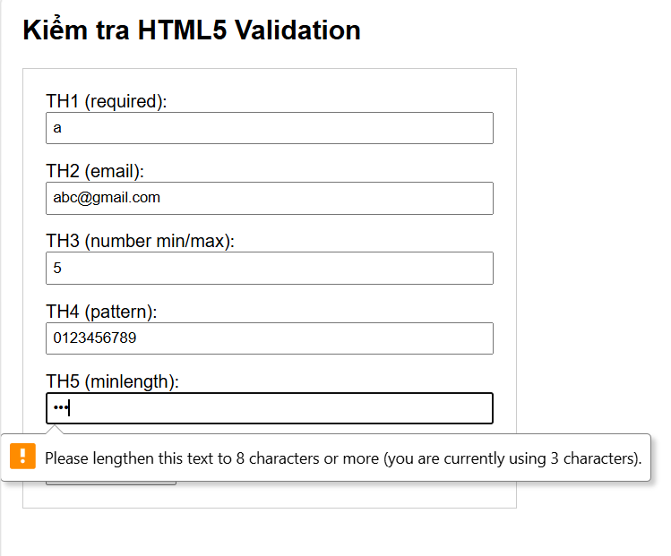

# PHẦN A — KIỂM TRA ĐỌC HIỂU
## Câu A1 (5đ) — Input Types

1. **type="email"** → Ô nhập text (bàn phím có @) → Tự động kiểm tra định dạng email (phải có @ và domain) → Dùng cho form đăng ký/đăng nhập.
2. **type="password"** → Ô nhập text (ký tự bị che giấu bằng dấu •) → Không tự động (phụ thuộc vào pattern/minlength) → Dùng cho nhập mật khẩu tài khoản.
3. **type="number"** → Ô nhập số (có mũi tên tăng/giảm) → Chỉ cho phép nhập số, tự kiểm tra giới hạn min/max → Dùng để điều chỉnh số lượng sản phẩm trong giỏ hàng.
4. **type="tel"** → Ô nhập text (trên điện thoại hiện bàn phím số) → Không tự động (cần dùng thêm regex) → Dùng để nhập số điện thoại nhận hàng.
5. **type="radio"** → Nút tròn nhỏ → Ép buộc chỉ được chọn 1 lựa chọn duy nhất trong nhóm → Dùng để chọn phương thức thanh toán (ví dụ: COD hoặc Thẻ).
6. **type="checkbox"** → Nút hình vuông (tick chọn) → Kiểm tra bắt buộc chọn nếu có thuộc tính `required` → Dùng cho mục "Đồng ý với điều khoản dịch vụ".
7. **type="date"** → Ô văn bản có icon lịch (bật popup chọn ngày) → Ép buộc nhập đúng định dạng ngày tháng năm hợp lệ → Dùng để chọn ngày mong muốn nhận hàng.
8. **type="search"** → Ô nhập text (có dấu X để xóa nhanh chữ) → Không có validation đặc biệt → Dùng cho thanh tìm kiếm sản phẩm ở Header.
9. **type="url"** → Ô nhập text (bàn phím có sẵn / và .com) → Tự động bắt lỗi nếu link thiếu http:// hoặc https:// → Dùng cho các nhà bán hàng (Seller) nhập link shop của họ.
10. **type="file"** → Nút "Choose File" kèm tên tệp → Sẽ chặn các đuôi file không hợp lệ nếu có thuộc tính `accept` → Dùng để khách hàng tải ảnh lên khi yêu cầu đổi/trả sản phẩm.

---

## Câu A2 (5đ) — Validation Attributes

### 1. Dự đoán và Giải thích kết quả Validation

*   **Trường hợp 1:** `<input type="text" required value="">`
    *   **Dự đoán:** Trình duyệt sẽ chặn không cho Submit form và hiện thông báo lỗi (ví dụ: *"Please fill out this field"* hoặc *"Vui lòng điền vào trường này"*).
    *   **Tại sao:** Thuộc tính `required` bắt buộc người dùng không được để trống ô nhập liệu. Vì `value=""` (rỗng), điều kiện này bị vi phạm.

*   **Trường hợp 2:** `<input type="email" value="abc">`
    *   **Dự đoán:** Trình duyệt chặn Submit và báo lỗi định dạng (ví dụ: *"Please include an '@' in the email address"*).
    *   **Tại sao:** Thuộc tính `type="email"` tự động kích hoạt bộ kiểm tra định dạng email của trình duyệt. Chuỗi "abc" thiếu ký tự bắt buộc `@` và tên miền nên không hợp lệ.

*   **Trường hợp 3:** `<input type="number" min="1" max="10" value="15">`
    *   **Dự đoán:** Trình duyệt chặn Submit và báo lỗi vượt ngưỡng (ví dụ: *"Value must be less than or equal to 10"*).
    *   **Tại sao:** Thẻ quy định giá trị số lớn nhất được phép nhập là `max="10"`. Giá trị người dùng nhập là `15` đã vượt quá giới hạn này.

*   **Trường hợp 4:** `<input type="text" pattern="[0-9]{10}" value="abc123">`
    *   **Dự đoán:** Trình duyệt chặn Submit và yêu cầu nhập đúng định dạng (ví dụ: *"Please match the requested format"*).
    *   **Tại sao:** Thuộc tính `pattern="[0-9]{10}"` sử dụng Biểu thức chính quy (Regex) ép buộc chuỗi nhập vào phải có **đúng 10 ký tự** và **tất cả đều phải là số** từ 0 đến 9. Chuỗi "abc123" chứa chữ cái và mới chỉ có 6 ký tự nên vi phạm.

*   **Trường hợp 5:** `<input type="password" minlength="8" value="123">`
    *   **Dự đoán:** Trình duyệt chặn Submit và yêu cầu nhập thêm ký tự (ví dụ: *"Please lengthen this text to 8 characters or more"*).
    *   **Tại sao:** Thuộc tính `minlength="8"` quy định độ dài tối thiểu của chuỗi là 8 ký tự. Chuỗi "123" mới chỉ có độ dài là 3 nên không đủ điều kiện.

### 2. File kiểm thử `validation_test.html` và So sánh

*(Ghi chú: Em đã tạo file `validation_test.html` để chạy thử nghiệm các trường hợp trên. Kết quả thực tế khi bấm Submit hoàn toàn trùng khớp với các dự đoán lý thuyết ở phần 1. Thông báo lỗi sẽ bật ra ngay tại ô input đầu tiên bị lỗi).*

**Screenshot kết quả validation thực tế:**






---

## Câu A3 (5đ) — Accessibility

### 1. Tại sao `<label for="email">` quan trọng cho người dùng screen reader?
- **Khả năng đọc hiểu:** Trình đọc màn hình (Screen Reader) không có mắt để nhìn thấy chữ "Email" nằm cạnh ô nhập liệu. Thuộc tính `for` trong `<label>` (chỉ tới `id` của `<input>`) tạo ra một **sự gắn kết bằng mã nguồn (programmatic association)**. Khi người khiếm thị trỏ vào ô nhập liệu, Screen Reader sẽ tự động đọc to nội dung của thẻ `<label>` được liên kết, giúp họ biết ô này dùng để nhập gì.
- **Tiện ích bổ sung:** Ngoài việc hỗ trợ người khiếm thị, việc liên kết này giúp tăng diện tích click (người dùng chỉ cần bấm vào chữ "Email" là con trỏ chuột sẽ tự động nhảy vào ô input tương ứng).

### 2. Khi nào dùng `<fieldset>` + `<legend>`? Cho ví dụ cụ thể.
- **Cách dùng:** `<fieldset>` được sử dụng để nhóm các trường nhập liệu (inputs) có liên quan logic chặt chẽ với nhau thành một khối. `<legend>` hoạt động như một tiêu đề (caption) giải thích ý nghĩa cho toàn bộ khối `<fieldset>` đó. Nó cực kỳ quan trọng khi nhóm các nút `radio` hoặc `checkbox`.
- **Ví dụ cụ thể:** Nhóm các lựa chọn về Giới tính hoặc Địa chỉ.
```html
<fieldset>
    <legend>Chọn phương thức giao hàng:</legend>
    
    <input type="radio" id="express" name="shipping" value="express">
    <label for="express">Giao hỏa tốc</label><br>
    
    <input type="radio" id="standard" name="shipping" value="standard">
    <label for="standard">Giao tiêu chuẩn</label>
</fieldset>
```

### 3. `aria-label` dùng khi nào? Tại sao KHÔNG nên dùng `aria-label` khi đã có `<label>`?
- **Dùng khi nào:** Dùng để cung cấp nhãn cho Screen Reader khi trên giao diện **không có văn bản hiển thị** (ví dụ: Nút tìm kiếm chỉ có biểu tượng kính lúp 🔍, hoặc nút đóng cửa sổ chỉ có dấu ❌).
- **Tại sao KHÔNG nên dùng chung:** Nếu một thẻ input vừa có `<label>` (native) vừa có `aria-label`, trình đọc màn hình sẽ ưu tiên đọc `aria-label` và bỏ qua `<label>`. Nếu nội dung của hai thẻ này khác nhau, nó sẽ gây nhầm lẫn nghiêm trọng cho người khiếm thị. Nguyên tắc cao nhất trong Accessibility là: **Ưu tiên dùng thẻ HTML chuẩn (native) thay vì lạm dụng thuộc tính ARIA.**

---

## Câu A4 (5đ) — Media

*Nguồn tham chiếu: Chương ... (Bạn tự điền tên file tài liệu)*

### 1. Thuộc tính `loading="lazy"` trên thẻ ``:
- **Giải thích & Cải thiện:** Trì hoãn việc tải hình ảnh cho đến khi người dùng cuộn màn hình tới gần vị trí của ảnh đó (thay vì tải toàn bộ ảnh cùng lúc khi vừa vào web). Nó giúp cải thiện đáng kể tốc độ tải trang ban đầu (Page Load Speed), tăng điểm hiệu năng (Core Web Vitals) và tiết kiệm băng thông mạng (Data).
- **Khi nào KHÔNG nên dùng:** Tuyệt đối không dùng cho các hình ảnh nằm "above the fold" (những ảnh hiển thị ngay trên màn hình đầu tiên khi vừa vào trang web mà chưa cần cuộn, ví dụ: Logo, Banner Hero chính, Ảnh sản phẩm đầu tiên). Việc lạm dụng lazy load ở các ảnh này sẽ làm chậm trễ trải nghiệm nhìn thấy nội dung chính của người dùng.

### 2. Tại sao nên cung cấp nhiều `<source>` trong thẻ `<video>`?
- **Lý do:** Mỗi trình duyệt (Chrome, Safari, Firefox, Edge) hỗ trợ các định dạng và bộ giải mã (codec) video khác nhau. Bằng cách cung cấp nhiều thẻ `<source>`, trình duyệt sẽ tự động duyệt từ trên xuống dưới và chọn định dạng đầu tiên mà nó hỗ trợ để phát. Việc này giúp đảm bảo tính tương thích (Cross-browser compatibility) để video luôn xem được trên mọi thiết bị.
- **3 format video web phổ biến:**
  1. `MP4` (.mp4): Định dạng quốc dân, tương thích trên 100% các trình duyệt.
  2. `WebM` (.webm): Định dạng tối ưu cho web do Google phát triển, dung lượng nhẹ hơn MP4 nhưng chất lượng cao.
  3. `Ogg` (.ogv) hoặc định dạng mới `AV1`: Dùng làm phương án dự phòng bổ sung.

### 3. Thuộc tính `alt` trên `` dùng để làm gì?
- **Tác dụng:** `alt` (Alternative text) cung cấp văn bản thay thế khi hình ảnh bị lỗi không tải được. Quan trọng hơn, nó là cốt lõi của Accessibility (Screen Reader sẽ đọc đoạn text này cho người khiếm thị hiểu ảnh) và là yếu tố bắt buộc của SEO (giúp Google Bot hiểu nội dung ảnh để xếp hạng tìm kiếm).
- **Viết `alt` tốt cho 3 trường hợp cụ thể:**
  - **Ảnh sản phẩm iPhone 16:** `alt="Điện thoại iPhone 16 Pro Max 256GB màu Titan Tự Nhiên chụp góc nghiêng từ mặt lưng"` (Cần mô tả thật chi tiết, rõ ràng đặc điểm của sản phẩm).
  - **Ảnh trang trí (decorative):** `alt=""` (Bắt buộc phải có thẻ alt nhưng để giá trị rỗng. Khi đó trình đọc màn hình sẽ tự động bỏ qua ảnh này, giúp người khiếm thị không bị nghe các thông tin rác rưởi không cần thiết như viền, hoa văn...).
  - **Ảnh biểu đồ doanh thu Q1/2026:** `alt="Biểu đồ cột thể hiện doanh thu Quý 1 năm 2026 đạt mức 500 tỷ đồng, tăng 15% so với Quý 4 năm 2025"` (Phải tóm tắt được thông tin/số liệu cốt lõi mà biểu đồ muốn truyền tải, vì người khiếm thị không thể nhìn thấy các cột hay đường thẳng trên biểu đồ).

---

## Câu A5 (5đ) — So sánh `<figure>` vs ``

### 1. Cách 1 (Chỉ dùng thẻ ``)
- **Khi nào dùng:** Dùng cho các hình ảnh đơn lẻ, ảnh minh họa thông thường nằm xen kẽ trong luồng văn bản. Những ảnh này không mang tính chất là một khối nội dung độc lập và **không cần** dòng chú thích (caption) giải nghĩa gắn liền với nó.
- **2 Ví dụ thực tế:**
  1. Ảnh Logo của trang web đặt trên thanh điều hướng (Header Navigation).
  2. Ảnh Avatar (ảnh đại diện) thu nhỏ của người dùng trong phần danh sách bình luận hoặc đánh giá sản phẩm.

### 2. Cách 2 (Dùng `<figure>` kết hợp `<figcaption>`)
- **Khi nào dùng:** Dùng khi hình ảnh (hoặc biểu đồ, đoạn code, video...) là một khối nội dung **độc lập (self-contained)**, mang một ý nghĩa trọn vẹn và **cần có một dòng chú thích** đi kèm. Cấu trúc này liên kết chặt chẽ về mặt ngữ nghĩa (Semantic) giữa bức ảnh và dòng chữ chú thích, giúp công cụ tìm kiếm (SEO) và Screen Reader hiểu rõ dòng text đó dùng để mô tả cho bức ảnh nào.
- **2 Ví dụ thực tế:**
  1. Một biểu đồ/đồ thị thống kê trong bài báo cáo, bên dưới có dòng chú thích giải thích ý nghĩa số liệu (Ví dụ: *Biểu đồ 1: Doanh thu bán hàng Quý 1 năm 2026*).
  2. Một bức ảnh về tác phẩm nghệ thuật trong bài viết, bên dưới (figcaption) ghi tên tác phẩm, năm sáng tác và tên tác giả. (Hoặc dùng để bọc một khối hiển thị sản phẩm như ở ví dụ đề bài: gồm ảnh sản phẩm, tên và mức giá đi kèm).

---

# PHẦN C — PHÂN TÍCH & SUY LUẬN

## Câu C1 (10đ) — Debug Form

**Lỗi 1: Dòng 1** — Thẻ `<form>` thiếu các thuộc tính bắt buộc là `action` (nơi gửi dữ liệu) và `method` (phương thức gửi).
**Sửa:** `<form action="/submit-url" method="POST">`

**Lỗi 2: Dòng 2** — Input "Tên" không có `<label for="...">` (vi phạm Accessibility), thiếu thuộc tính `name` để gửi dữ liệu và thiếu `required` (không có Validation).
**Sửa:** `<label for="name">Tên:</label> <input type="text" id="name" name="name" required>`

**Lỗi 3: Dòng 4** — Input "Email" lạm dụng `placeholder` thay cho thẻ `<label>`. Điều này rất tệ cho Accessibility vì khi người dùng gõ chữ, placeholder sẽ biến mất khiến họ quên mất ô này dùng để làm gì. Cũng thiếu `name`, `id` và `required`.
**Sửa:** `<label for="email">Email:</label> <input type="email" id="email" name="email" placeholder="Email của bạn" required>`

**Lỗi 4: Dòng 6, 7** — Hai ô "Mật khẩu" không có `<label>` đi kèm, không có thuộc tính `name` để Server phân biệt đâu là mật khẩu chính/phụ, và thiếu Validation độ dài tối thiểu (`minlength`).
**Sửa:** 
`<label for="pwd">Mật khẩu:</label> <input type="password" id="pwd" name="pwd" placeholder="Mật khẩu" required minlength="8">`
`<label for="pwd-confirm">Nhập lại mật khẩu:</label> <input type="password" id="pwd-confirm" name="pwd-confirm" placeholder="Nhập lại mật khẩu" required>`

**Lỗi 5: Dòng 9** — Input "Phone" dùng sai semantic `type="text"`. Đáng lẽ phải dùng `type="tel"` để các thiết bị di động tự động hiển thị bàn phím số. Đồng thời thiếu `<label>`, `name` và `id`.
**Sửa:** `<label for="phone">Phone:</label> <input type="tel" id="phone" name="phone" value="0901234567" required>`

**Lỗi 6: Dòng 11** — Thẻ `<select>` không có `<label>` gắn kèm để giải thích ý nghĩa, không có thuộc tính `name` và `id` (nếu không có `name`, người dùng chọn xong bấm Submit Server cũng không nhận được dữ liệu thành phố).
**Sửa:** `<label for="city">Tỉnh/Thành phố:</label> <select id="city" name="city">`

**Lỗi 7: Dòng 12, 13** — Các thẻ `<option>` bên trong select bị thiếu thuộc tính `value`. Dữ liệu gửi đi cần được chuẩn hóa (ví dụ: `hn`) chứ không nên gửi nguyên chữ tiếng Việt có dấu (`Hà Nội`).
**Sửa:** 
`<option value="hanoi">Hà Nội</option>`
`<option value="hcm">TP.HCM</option>`

**Lỗi 8: Dòng 16, 17, 18** — Lỗi Logic và Accessibility nghiêm trọng. Có thẻ `<label>` nhưng lại hoàn toàn THIẾU mất ô checkbox (`<input type="checkbox">`), và label không có thuộc tính `for` để liên kết.
**Sửa:** 
`<input type="checkbox" id="terms" name="terms" required>`
`<label for="terms">Tôi đồng ý điều khoản</label>`

---

## Câu C2 (10đ) — Thiết kế chiến lược Validation

**1. Viết pattern (Regex) cho CMND/CCCD và Số tài khoản:**
- **CMND/CCCD (Đúng 12 chữ số):** `pattern="[0-9]{12}"` (hoặc `^\d{12}$`)
- **Số tài khoản (10-15 chữ số):** `pattern="[0-9]{10,15}"` (hoặc `^\d{10,15}$`)

**2. HTML5 validation đủ an toàn cho ứng dụng ngân hàng chưa? Tại sao?**
- **Trả lời:** TUYỆT ĐỐI KHÔNG đủ an toàn.
- **Tại sao:** HTML5 Validation chỉ là kiểm tra ở lớp giao diện (Client-side), mục đích chính là mang lại trải nghiệm tốt cho người dùng (UX) bằng cách báo lỗi sớm để họ sửa. Bất kỳ ai có chút kiến thức IT đều có thể dễ dàng ấn F12 (DevTools), xóa các thuộc tính `required`, `pattern`, `maxlength` đi, hoặc sử dụng các công cụ như Postman để gửi thẳng dữ liệu độc hại qua mặt trình duyệt tới máy chủ. 

**3. Liệt kê 3 loại validation mà HTML5 KHÔNG THỂ làm được (Phải dùng JavaScript):**
1. **Validation chéo (Cross-field Validation):** HTML5 không thể so sánh giá trị giữa 2 ô input với nhau. Ví dụ: Không thể kiểm tra ô "Nhập lại mật khẩu" có khớp chính xác với ô "Mật khẩu" vừa nhập hay không.
2. **Kiểm tra tính hợp lệ về mặt logic/nghiệp vụ:** HTML5 có thể chặn người dùng nhập ngày sinh ở tương lai, nhưng không thể tự tính toán xem người đó đã đủ 18 tuổi để mở thẻ ngân hàng hay chưa.
3. **Validation bất đồng bộ (Asynchronous Validation):** HTML5 không thể tự động kiểm tra xem Email, Số điện thoại hay Số CCCD này đã tồn tại trong cơ sở dữ liệu của ngân hàng hay chưa trước khi người dùng bấm Submit.

**4. Nêu 2 rủi ro bảo mật nếu chỉ validate trên Frontend mà không validate Backend:**
1. **Lỗ hổng Injection (SQL Injection / XSS):** Kẻ gian bypass frontend và gửi các đoạn mã độc SQL hoặc JavaScript trực tiếp lên server. Nếu Backend tin tưởng tuyệt đối dữ liệu này và lưu thẳng vào Database, toàn bộ hệ thống có thể bị đánh sập hoặc thông tin thẻ của người dùng khác sẽ bị đánh cắp.
2. **Thao túng nghiệp vụ tài chính:** Kẻ xấu có thể can thiệp vào Request để thay đổi số tiền chuyển khoản thành số âm (ví dụ: chuyển `-10.000.000đ`), hoặc sửa số tài khoản người nhận. Nếu Backend không validate lại logic, hệ thống sẽ thực hiện giao dịch sai lệch gây thiệt hại tài sản nghiêm trọng. Nguyên tắc vàng là: **"Không bao giờ tin tưởng dữ liệu gửi lên từ Client"**.
