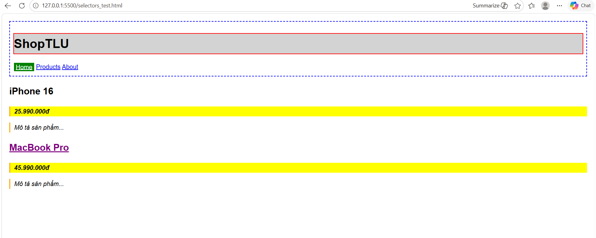
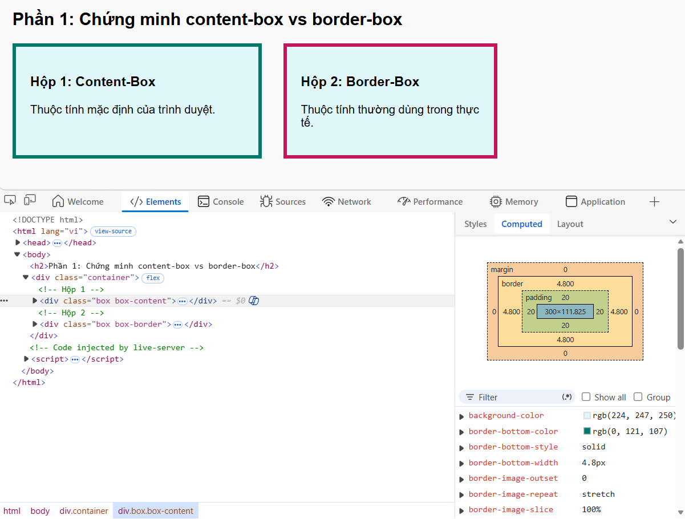
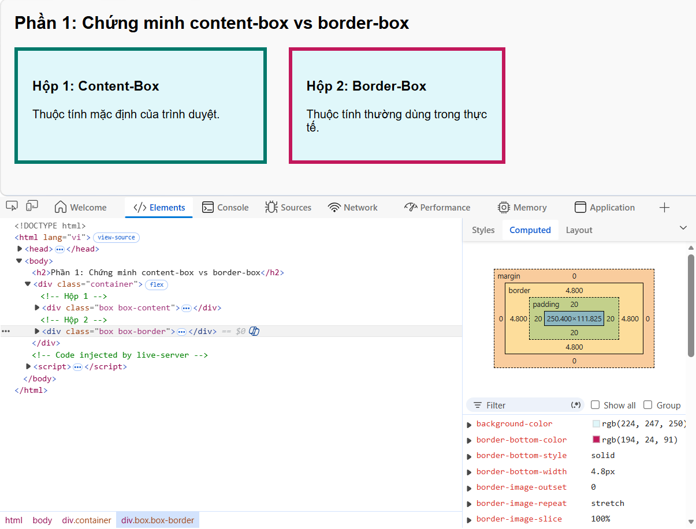
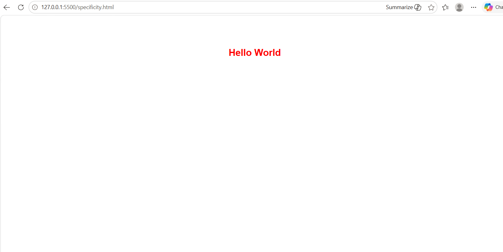

# PHẦN A — KIỂM TRA ĐỌC HIỂU

## Câu A1 (5đ) — 3 Cách nhúng CSS

**1. Inline CSS (Nhúng trực tiếp vào thẻ HTML)**
*   **Ví dụ code:**
    ```html
    <p style="color: red; font-size: 16px;">Đoạn văn này màu đỏ</p>
    ```
*   **Ưu điểm:** Nhanh chóng, áp dụng trực tiếp và có độ ưu tiên cao nhất, ghi đè được các thiết lập CSS khác.
*   **Nhược điểm:** Khó bảo trì, không thể tái sử dụng cho các thẻ khác, làm mã HTML trở nên rối rắm và khó đọc.
*   **Khi nào nên dùng:** Khi cần test/debug nhanh trên trình duyệt, tạo template cho Email (HTML Email), hoặc khi dùng JavaScript để thay đổi style động.

**2. Internal CSS (Nhúng bên trong thẻ `<style>` của `<head>`)**
*   **Ví dụ code:**
    ```html
    <head>
        <style>
            p { color: blue; font-size: 18px; }
        </style>
    </head>
    ```
*   **Ưu điểm:** Gom toàn bộ code CSS của một trang vào một chỗ, không cần tạo thêm file bên ngoài.
*   **Nhược điểm:** Không thể tái sử dụng đoạn CSS này cho các trang web (file HTML) khác. Tăng dung lượng của file HTML.
*   **Khi nào nên dùng:** Dùng cho các trang web chỉ có 1 trang duy nhất (Single Page), hoặc khi trang đó có một giao diện đặc thù hoàn toàn khác biệt so với phần còn lại của website.

**3. External CSS (Nhúng từ file `.css` bên ngoài)**
*   **Ví dụ code:**
    ```html
    <!-- Trong file index.html -->
    <head>
        <link rel="stylesheet" href="style.css">
    </head>
    ```
    ```css
    /* Trong file style.css */
    p { color: green; font-size: 20px; }
    ```
*   **Ưu điểm:** Tách biệt hoàn toàn code giao diện (CSS) và cấu trúc (HTML). Dễ bảo trì, tái sử dụng được cho hàng trăm trang HTML khác nhau. Giúp trang tải nhanh hơn vì trình duyệt sẽ lưu cache file CSS này.
*   **Nhược điểm:** Tốn thêm 1 request (yêu cầu) tải file từ trình duyệt lên server (tuy nhiên nhược điểm này rất nhỏ so với lợi ích mang lại).
*   **Khi nào nên dùng:** Đây là **Best Practice** (Tiêu chuẩn tốt nhất). Luôn luôn ưu tiên dùng cách này cho mọi dự án thực tế.

---

**Câu hỏi thêm: Nếu cùng 1 element có cả 3 cách CSS đồng thời áp dụng, cách nào "thắng"? Giải thích tại sao.**

*   **Cách "thắng":** **Inline CSS** sẽ là cách chiến thắng và được áp dụng cuối cùng.
*   **Giải thích:** Trong CSS có một quy tắc gọi là **Tính đặc thù (CSS Specificity) / Độ ưu tiên**. Trình duyệt sẽ tính điểm ưu tiên để quyết định style nào được áp dụng. 
    *   Inline CSS (thuộc tính `style="..."`) có điểm đặc thù cao nhất (1000 điểm).
    *   Internal và External CSS sử dụng các selector (id, class, thẻ) có điểm thấp hơn. 
    *   *(Lưu ý: Giữa Internal và External, cái nào được khai báo sau cùng trong thẻ `<head>` thì cái đó sẽ thắng, nhưng cả hai đều sẽ bị Inline CSS ghi đè).

---

## Câu A2 (8đ) — CSS Selectors — Dự đoán kết quả

**1. Dự đoán kết quả Selectors:**

1. `h1` 
   → Chọn: Thẻ `<h1>` có nội dung chữ là **"ShopTLU"**.
2. `.price` 
   → Chọn: Tất cả các thẻ có class là `price` (2 thẻ). Nội dung chữ là **"25.990.000đ"** và **"45.990.000đ"**.
3. `#app header` 
   → Chọn: Toàn bộ thẻ `<header>` nằm trong `#app`. Nội dung bao gồm chữ **"ShopTLU"** và các link điều hướng **"Home", "Products", "About"**.
4. `nav a:first-child` 
   → Chọn: Thẻ `<a>` đầu tiên nằm trực tiếp trong thẻ `<nav>`. Nội dung chữ là **"Home"**.
5. `.product.featured h2` 
   → Chọn: Thẻ `<h2>` nằm trong phần tử có ĐỒNG THỜI 2 class là `product` và `featured`. Nội dung chữ là **"MacBook Pro"**.
6. `article > p` 
   → Chọn: Tất cả các thẻ `<p>` là CON TRỰC TIẾP của thẻ `<article>` (gồm 4 thẻ). Nội dung chữ là: **"25.990.000đ"**, **"Mô tả sản phẩm..."** (của iPhone 16) và **"45.990.000đ"**, **"Mô tả sản phẩm..."** (của MacBook Pro).
7. `a[href="/"]` 
   → Chọn: Thẻ `<a>` có chính xác thuộc tính `href="/"`. Nội dung chữ là **"Home"**.
8. `.top-bar.dark h1` 
   → Chọn: Thẻ `<h1>` nằm trong phần tử có đồng thời 2 class `top-bar` và `dark`. Nội dung chữ là **"ShopTLU"**.

---

**2. File kiểm thử `selectors_test.html`**

*(Ghi chú: Em đã tạo file `selectors_test.html` và thêm CSS với các màu sắc/viền khác nhau để highlight chính xác các phần tử được chọn như dự đoán ở trên).*

**Screenshot kiểm chứng:**


---

## Câu A3 (7đ) — Box Model — Tính toán kích thước

**1. Trường hợp 1: content-box (mặc định)**
*   **Chiều rộng hiển thị (Visible width):** `450px`
    *   *Cách tính:* width (400) + padding trái (20) + padding phải (20) + border trái (5) + border phải (5) = 450px.
*   **Không gian chiếm trên trang (Total space):** `470px`
    *   *Cách tính:* Chiều rộng hiển thị (450) + margin trái (10) + margin phải (10) = 470px.

**2. Trường hợp 2: border-box**
*   **Chiều rộng hiển thị (Visible width):** `400px`
    *   *Cách tính:* Thuộc tính `box-sizing: border-box` sẽ ép toàn bộ padding và border nằm gọn bên trong kích thước `width` đã khai báo ban đầu.
*   **Kích thước content thực tế (Actual content width):** `350px`
    *   *Cách tính:* width tổng (400) - padding trái (20) - padding phải (20) - border trái (5) - border phải (5) = 350px.
*   **Không gian chiếm trên trang (Total space):** `420px`
    *   *Cách tính:* Chiều rộng hiển thị (400) + margin trái (10) + margin phải (10) = 420px.

**3. Trường hợp 3: Margin collapse (Sáp nhập lề)**
*   **Khoảng cách giữa box-a và box-b:** `40px`
*   **Giải thích tại sao KHÔNG PHẢI 65px:** Đây là hiện tượng "Margin Collapse" (Sáp nhập lề) đặc trưng trong CSS. Khi hai margin dọc (top và bottom) của hai thẻ block liền kề chạm nhau, trình duyệt sẽ không cộng dồn chúng lại (25 + 40 = 65) mà sẽ gộp chúng lại và chỉ lấy giá trị **lớn hơn** (ở đây là 40px).

**4. Nâng cao: Margin có số âm**
*   **Khoảng cách:** `30px`
*   **Giải thích:** Khi xảy ra hiện tượng Margin Collapse mà có một giá trị âm và một giá trị dương, trình duyệt sẽ áp dụng phép cộng đại số. Cách tính: 40px + (-10px) = 30px.

---

## Câu A4 (5đ) — Specificity (Độ ưu tiên)

**1. Tính specificity score (a, b, c) cho mỗi rule:**
Quy tắc tính điểm theo hệ số (a: số lượng ID, b: số lượng Class/Attributes/Pseudo-classes, c: số lượng Elements/Pseudo-elements):
*   **Rule A (`p`):** (0, 0, 1) — Chỉ có 1 thẻ HTML.
*   **Rule B (`.price`):** (0, 1, 0) — Chỉ có 1 class.
*   **Rule C (`#main-price`):** (1, 0, 0) — Chỉ có 1 ID.
*   **Rule D (`p.price`):** (0, 1, 1) — Có 1 class và 1 thẻ HTML.

**2. Element sẽ có màu gì? Giải thích:**
*   **Kết quả:** Màu **đỏ (red)**.
*   **Giải thích:** Trình duyệt sẽ so sánh điểm Specificity của các rule cùng target vào một phần tử. Điểm của Rule C là (1, 0, 0) - cao nhất trong số 4 rule vì bộ chọn ID có trọng số lớn hơn class và thẻ HTML. Do đó, rule của `#main-price` sẽ được áp dụng.

**3. Nếu thêm `<p class="price" id="main-price" style="color: orange;">`, element có màu gì?**
*   **Kết quả:** Màu **cam (orange)**.
*   **Giải thích:** CSS khai báo trực tiếp trên thẻ (Inline CSS) có độ ưu tiên cao hơn mọi CSS Selectors thông thường (ID, Class, Element). Điểm specificity của nó tương đương với mức (1, 0, 0, 0), do đó nó sẽ ghi đè màu đỏ của Rule C.

**4. Nếu Rule A thêm `!important`, element có màu gì? Tại sao?**
*   **Kết quả:** Màu **đen (black)**.
*   **Giải thích:** Từ khóa `!important` là ngoại lệ lớn nhất, phá vỡ mọi quy tắc tính điểm Specificity thông thường. Dù Rule A (`p`) có bộ chọn yếu nhất, nhưng khi gắn thêm `!important`, trình duyệt sẽ ép buộc ưu tiên rule này lên hàng đầu. Nó sẽ ghi đè cả ID selector và Inline CSS (trừ khi các chỗ khác cũng dùng `!important`).

---

## Bài B1 — Liệt kê 5 loại Selector sử dụng trong file `style.css`

Trong file `style.css`, em đã sử dụng đầy đủ 5 loại selector (bộ chọn) khác nhau, cụ thể như sau:

**1. Element Selector (Bộ chọn thẻ HTML):** 
   - Nhắm trực tiếp vào tên thẻ HTML.
   - *Ví dụ trong bài:* `body`, `header`, `footer`, `table`.
   - 
**2. ID Selector (Bộ chọn ID):** 
   - Nhắm vào phần tử có thuộc tính id cụ thể (kí hiệu bằng dấu `#`).
   - *Ví dụ trong bài:* `#main-content` (Định dạng cho thẻ `<main>`).
   - 
**3. Class Selector (Bộ chọn Lớp):** 
   - Nhắm vào các phần tử có chung class (kí hiệu bằng dấu `.`).
   - *Ví dụ trong bài:* `.active` (Định dạng riêng cho link đang được chọn).
   - 
**4. Descendant Selector (Bộ chọn Con cháu):** 
   - Nhắm vào một phần tử nằm bên trong một phần tử khác (cách nhau bởi dấu cách).
   - *Ví dụ trong bài:* `nav a` (Chỉ chọn các thẻ `<a>` nằm bên trong thẻ `<nav>`), `thead th` (Chỉ chọn thẻ `<th>` nằm trong `<thead>`).
   - 
**5. Pseudo-class Selector (Bộ chọn Lớp giả):** 
   - Nhắm vào trạng thái đặc biệt của một phần tử.
   - *Ví dụ trong bài:* `nav a:hover` (Trạng thái khi di chuột qua link), `tbody tr:nth-child(even)` (Chọn các thẻ `<tr>` ở vị trí chẵn để làm hiệu ứng ngựa vằn zebra-striping).

---

## Bài B2 — Box Model Lab (Phần 1)

**1. Kết quả đo từ DevTools:**
*   **Hộp 1 (content-box):** Chiều rộng thực tế hiển thị trên trình duyệt = **350px**.
    *(Giải thích phép tính: `width` 300px + `padding` trái 20px + `padding` phải 20px + `border` trái 5px + `border` phải 5px).*
*   **Hộp 2 (border-box):** Chiều rộng thực tế hiển thị trên trình duyệt = **300px**.
    *(Lý do: Trình duyệt ép `padding` (40px) và `border` (10px) vào bên trong, lúc này phần không gian trống lõi chứa nội dung (content area) bị bóp nhỏ lại chỉ còn 250px).*

**2. Giải thích sự khác biệt:**
*   Với **`content-box`** (cách hoạt động mặc định), thuộc tính `width` chỉ định nghĩa chiều rộng của phần lõi chứa chữ. Bất kỳ padding hay border nào được thêm vào sẽ cộng dồn dội ra ngoài, làm cho tổng kích thước của khối hộp phình to ra. Điều này dễ làm vỡ layout nếu không tính toán kỹ.
*   Với **`border-box`**, thuộc tính `width` định nghĩa tổng kích thước giới hạn cuối cùng của khối hộp (bao phủ toàn bộ content, padding và border). Khi bạn khai báo thêm padding hay border, trình duyệt sẽ tự động "ăn lẹm" vào không gian của content bên trong để đảm bảo kích thước tổng thể bên ngoài không bị vượt quá giới hạn đã đặt ra.

**Ảnh chụp màn hình Hộp 1 (Content-Box):**


**Ảnh chụp màn hình Hộp 2 (Border-Box):**


---

## Bài B3 (15đ) — Specificity Battle

**1. Liệt kê 10 rules + Specificity score:**
*(Điểm được tính theo hệ số (a,b,c) tương ứng: a = ID, b = Class/Pseudo-class/Attribute, c = Element/Pseudo-element)*
1. `*` → Specificity: **(0,0,0)** (Màu xám)
2. `p` → Specificity: **(0,0,1)** (Màu nâu)
3. `.text` → Specificity: **(0,1,0)** (Màu hồng)
4. `p.text` → Specificity: **(0,1,1)** (Màu cam)
5. `.text.highlight` → Specificity: **(0,2,0)** (Màu vàng)
6. `p.text.highlight` → Specificity: **(0,2,1)** (Màu tím)
7. `#demo` → Specificity: **(1,0,0)** (Màu cyan)
8. `p#demo` → Specificity: **(1,0,1)** (Màu xanh dương)
9. `#demo.text.highlight` → Specificity: **(1,2,0)** (Màu xanh lá)
10. `p#demo.text.highlight` → Specificity: **(1,2,1)** (Màu đỏ)

**2. Element cuối cùng hiển thị màu gì? Tại sao?**
- **Kết quả:** Chữ "Hello World" hiển thị màu **Đỏ (Red)**.
- **Tại sao:** Trình duyệt khi đọc CSS sẽ tính điểm Specificity cho tất cả các rule nhắm vào cùng 1 phần tử. Rule số 10 (`p#demo.text.highlight`) có điểm cao nhất là (1,2,1). Vì điểm này áp đảo tất cả các rule còn lại, trình duyệt sẽ quyết định dùng màu đỏ của nó để hiển thị.

**3. Thay đổi thứ tự rules trong CSS file. Kết quả có đổi không? Giải thích.**
- **Kết quả:** KHÔNG THAY ĐỔI (Vẫn là màu Đỏ).
- **Giải thích:** Trong CSS, thứ tự viết code (hay còn gọi là tính chất Cascade - xếp tầng) chỉ có tác dụng "phá vỡ thế hòa" khi 2 rules có **cùng mức điểm Specificity**. Ở ví dụ trên, toàn bộ 10 rules đều có điểm Specificity chênh lệch và khác nhau hoàn toàn. Do đó, điểm Specificity đã quyết định xong "người chiến thắng", vị trí của dòng code (nằm trên hay nằm dưới) không còn ý nghĩa nữa.

**Kết quả hiển thị màu:**


---

## Câu C1 (10đ) — Debug CSS Layout

**1. Tính chiều rộng thực tế (Box Model: content-box mặc định)**
*   **Sidebar:** `width` (300px) + `padding` trái/phải (20px * 2) + `border` trái/phải (1px * 2) = **342px**
*   **Content:** `width` (660px) + `padding` trái/phải (30px * 2) + `border` trái/phải (1px * 2) = **722px**
*   **Tổng chiều rộng thực tế của 2 khối:** 342px + 722px = **1064px**

**2. Giải thích tại sao layout bị vỡ**
Thẻ `.container` bao bọc bên ngoài được thiết lập chiều rộng cố định là **960px**. Tuy nhiên, do trình duyệt sử dụng mô hình Box Model mặc định là `content-box`, nó sẽ cộng dồn padding và border vào kích thước tổng. Hậu quả là tổng chiều rộng thực tế của sidebar và content lên tới **1064px**. Vì 1064px vượt quá giới hạn 960px của container, không gian theo chiều ngang không đủ chứa cả hai khối đứng cạnh nhau, buộc khối `.content` bị đẩy (float drop) xuống dòng mới.

**3. Đưa ra 2 cách sửa khác nhau**

*   **Cách 1: Sử dụng `box-sizing: border-box` (Khuyên dùng)**
    Chỉ cần thêm thuộc tính `box-sizing: border-box;` vào cả `.sidebar` và `.content`. Thuộc tính này sẽ "ép" padding và border nằm gọn vào bên trong kích thước `width` đã khai báo.
    Lúc này tổng chiều rộng thực tế sẽ là: Sidebar (300px) + Content (660px) = Đúng 960px (vừa khít container).

*   **Cách 2: Không dùng `border-box` (Tính toán lại Width thủ công)**
    Giữ nguyên `content-box` mặc định, nhưng ta phải trừ bớt giá trị `width` ban đầu của mỗi khối đi một khoảng đúng bằng tổng padding và border của khối đó:
    *   `.sidebar`: `width` mới = 300 - 40 (padding) - 2 (border) = **258px**
    *   `.content`: `width` mới = 660 - 60 (padding) - 2 (border) = **598px**
