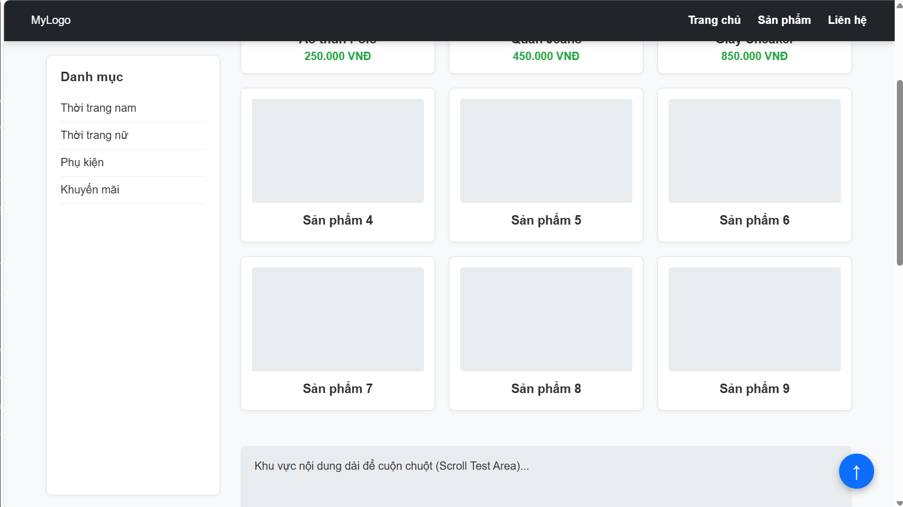
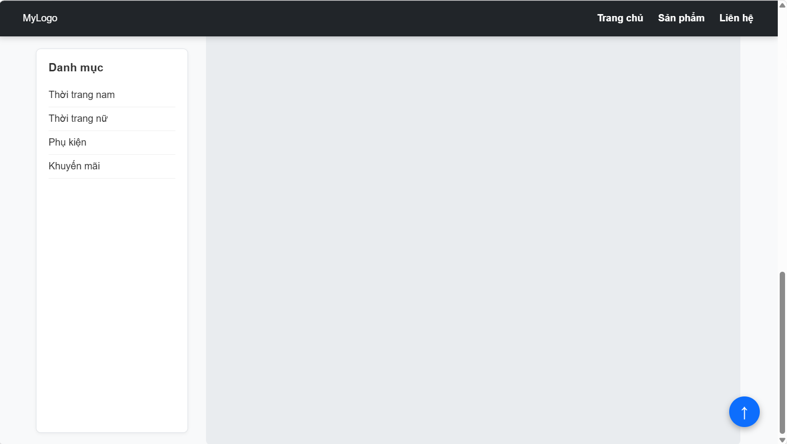
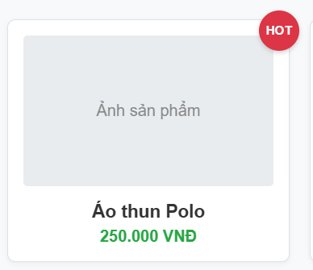

## Câu A1 — 5 Loại Positioning

**1. Bảng so sánh 5 loại Positioning:**

| Position | Vẫn chiếm chỗ trong flow? | Tham chiếu vị trí (Mốc tọa độ) | Cuộn theo trang? | Use case (Khi nào dùng) |
| :--- | :--- | :--- | :--- | :--- |
| **static** | Có (Mặc định) | Không áp dụng (Tuân theo luồng chảy tự nhiên của HTML). | Có | Dùng làm giá trị mặc định cho mọi phần tử khi không cần định vị đặc biệt. |
| **relative** | Có | Tham chiếu vào **vị trí ban đầu của chính nó** trước khi bị dịch chuyển. | Có | Dịch chuyển nhẹ phần tử mà không làm hỏng bố cục xung quanh; tạo mốc tham chiếu (hệ quy chiếu) cho phần tử con `absolute`. |
| **absolute** | Không (Bị nhấc khỏi luồng HTML) | Tham chiếu vào **phần tử cha/tổ tiên gần nhất có position khác static** (Nearest positioned ancestor). | Có | Làm Tooltip, Dropdown menu, nút "X" ở góc popup, nhãn dán "Sale" góc hình ảnh. |
| **fixed** | Không (Bị nhấc khỏi luồng HTML) | Tham chiếu vào **Viewport** (Cửa sổ hiển thị của trình duyệt). | Không (Đứng im một chỗ) | Làm thanh điều hướng (Navbar) luôn nổi trên cùng, nút "Back to top", khung chat góc dưới màn hình. |
| **sticky** | Có | Tham chiếu vào **Viewport** (trình duyệt) VÀ **Phần tử chứa nó** (Container). | CÓ, cho đến khi đạt điểm ngưỡng (threshold) thì KHÔNG (dính lại). | Làm Header của bảng, thanh mục lục (TOC) trượt dọc theo bài viết, tiêu đề danh bạ chữ cái. |

---

**2. Giải đáp câu hỏi thêm:**

*   **Khi nào `absolute` tham chiếu `body` (tài liệu HTML)?**
    Thẻ có `position: absolute` sẽ tham chiếu đến `body` (mốc viewport ban đầu) khi và chỉ khi trên cây gia phả của nó (từ cha, ông, cố...) **KHÔNG CÓ** bất kỳ phần tử nào được gán thuộc tính `position` khác `static`.

*   **Khi nào tham chiếu parent (phần tử cha)?**
    Nó sẽ tham chiếu parent khi phần tử parent đó được thiết lập một thuộc tính `position` khác với `static` (thường người ta sẽ dùng `position: relative` cho phần tử cha để làm mốc).

*   **Giải thích khái niệm "nearest positioned ancestor" (Tổ tiên được định vị gần nhất):**
    Khi bạn gắn `position: absolute` cho một phần tử, trình duyệt sẽ không ngay lập tức lấy thẻ cha trực tiếp làm mốc. Thay vào đó, nó sẽ dò tìm ngược lên trên cây DOM (từ cha -> ông -> cụ -> kị...). 
    Phần tử **đầu tiên** mà nó gặp trên đường đi có thiết lập `position` là `relative`, `absolute`, `fixed`, hoặc `sticky` sẽ được chọn làm mốc tọa độ (gốc tọa độ 0,0 cho top, right, bottom, left). Nếu dò lên đến tận cùng (thẻ `<html>`) mà không thấy ai, nó sẽ lấy cửa sổ tài liệu (body) làm mốc.

---

### Câu A2 — Flexbox vs Grid

**Trường hợp 1: Flex chia đều**
*   **Bố cục dự đoán:** 1 hàng ngang duy nhất gồm 4 phần tử. 
*   **Giải thích:** Do thuộc tính `flex: 1`, cả 4 item sẽ chia đều không gian và có chiều rộng bằng nhau (mỗi item chiếm đúng 25% chiều rộng container).
*   **Sơ đồ (Text Art):**
    ```text
    +-------------------------------------------------------------+
    | [   Item 1 (25%)   ][   Item 2 (25%)   ][   Item 3 (25%)   ][   Item 4 (25%)   ] |
    +-------------------------------------------------------------+
    
    ```

**Trường hợp 2: Flex bọc dòng (Wrap)**
*   **Bố cục dự đoán:** Gồm 3 hàng, mỗi hàng 2 cột.
*   **Giải thích:** Chiều rộng mỗi item là 45%, cộng với margin trái phải 2.5% thì tổng không gian 1 item chiếm là 50%. Do đó, một hàng chỉ chứa được tối đa 2 items (50% + 50% = 100%). Khi có 6 items và dùng `flex-wrap: wrap`, nó sẽ tự động đẩy xuống dòng, tạo thành 3 hàng.
*   **Sơ đồ (Text Art):**
    ```text
    +-----------------------------------+
    |  [   Item 1   ]   [   Item 2   ]  |
    |  [   Item 3   ]   [   Item 4   ]  |
    |  [   Item 5   ]   [   Item 6   ]  |
    +-----------------------------------+
    
    ```

**Trường hợp 3: Flex căn lề hai đầu**
*   **Bố cục dự đoán:** 1 hàng ngang. Item 1 nằm sát lề trái, Item 3 nằm sát lề phải, Item 2 nằm chính giữa. Cả 3 item được căn giữa theo trục dọc.
*   **Giải thích:** `justify-content: space-between` đẩy phần tử đầu và cuối ra sát hai mép, chia đều khoảng trống ở giữa. `align-items: center` giúp chúng cân bằng theo chiều dọc (cross-axis).
*   **Sơ đồ (Text Art):**
    ```text
    +-------------------------------------------------------------+
    | [Item 1] <-------- trống --------> [Item 2] <-------- trống --------> [Item 3] |
    +-------------------------------------------------------------+
    
    ```

**Trường hợp 4: Grid Layout hỗn hợp**
*   **Bố cục dự đoán:** 1 hàng gồm 3 cột có khoảng cách (gap) là 20px.
*   **Giải thích:** Cột 1 có chiều rộng cố định 200px. Cột 3 có chiều rộng cố định 200px. Cột 2 (`1fr`) sẽ phình to ra để chiếm toàn bộ không gian còn lại ở giữa.
*   **Sơ đồ (Text Art):**
    ```text
    +-------------------------------------------------------------+
    | [ 200px ]  gap  [      1fr (Không gian còn lại)      ]  gap  [ 200px ] |
    +-------------------------------------------------------------+
    
    ```

**Trường hợp 5: Grid Layout lặp lại (Repeat)**
*   **Bố cục dự đoán:** Grid chia làm 3 cột có kích thước bằng nhau (`1fr`). Gồm 3 hàng (2 hàng đầu đầy đủ, hàng cuối khuyết). Item 7 nằm ở ô đầu tiên của hàng thứ 3.
*   **Giải thích:** Có 7 items nhưng mỗi hàng chỉ nhận 3 cột. Do đó:
    *   Hàng 1 chứa: Item 1, 2, 3.
    *   Hàng 2 chứa: Item 4, 5, 6.
    *   Hàng 3 chứa: Item 7 (ở sát mép trái, hai cột còn lại của hàng 3 bị bỏ trống).
*   **Sơ đồ (Text Art):**
    ```text
    +-----------------------------------+
    |  [ Item 1 ]  [ Item 2 ]  [ Item 3 ] |
    |  [ Item 4 ]  [ Item 5 ]  [ Item 6 ] |
    |  [ Item 7 ]  [ Trống  ]  [ Trống  ] |
    +-----------------------------------+
    ```
---

## Bài B1 — Positioning Playground

Dưới đây là các hình ảnh chứng minh việc áp dụng thành công các loại Positioning trong CSS:

**1. Trạng thái Header khi scroll (chứng minh `position: fixed;`)**
*Header luôn cố định sát mép trên màn hình kể cả khi đã cuộn chuột xuống.*


**2. Trạng thái Sidebar khi scroll (chứng minh `position: sticky;`)**
*Sidebar cuộn theo trang cho đến khi cách đỉnh màn hình 80px thì nó bị "dính" lại, không trượt lên nữa.*


**3. Badge trên card sản phẩm & Nút Scroll to top**
*   **Badge HOT:** Sử dụng `position: absolute` (tròn, nền đỏ, chữ trắng) đặt lơ lửng ở góc trên bên phải của khung Product Card (`position: relative`).
*   **Nút ↑ (Scroll to top):** Sử dụng `position: fixed` giữ cố định vĩnh viễn ở góc dưới cùng bên phải màn hình.


---

## Câu C1 — Flexbox vs Grid: Khi nào dùng gì?

**1. Navigation bar ngang (logo + menu + buttons)**
*   **Lựa chọn:** **Flexbox**
*   **Giải thích:** Đây là bố cục 1 chiều (trục ngang). Flexbox sinh ra để làm việc này. Nó rất xuất sắc trong việc căn giữa theo chiều dọc (`align-items: center`) và đẩy các cụm phần tử dạt ra hai mép hoặc cách đều nhau (`justify-content: space-between`).

**2. Lưới ảnh Instagram (3 cột đều nhau, số ảnh không biết trước)**
*   **Lựa chọn:** **Grid**
*   **Giải thích:** Đây là bố cục 2 chiều nghiêm ngặt. Các bức ảnh phải thẳng hàng với nhau ở cả hàng và cột. CSS Grid với thuộc tính `grid-template-columns: repeat(3, 1fr)` sẽ tự động tạo lưới 3 cột hoàn hảo bất kể người dùng tải lên bao nhiêu bức ảnh.

**3. Layout blog: main content + sidebar**
*   **Lựa chọn:** **Grid** (hoặc kết hợp)
*   **Giải thích:** Đây là cấu trúc vĩ mô (macro-layout) của cả một trang web. Grid kiểm soát bố cục vĩ mô rất tốt. Chỉ cần 1 dòng lệnh như `grid-template-columns: 1fr 300px;` là bạn đã có ngay phần nội dung chính co giãn linh hoạt và phần sidebar cố định.

**4. Footer với 4 cột thông tin (Về chúng tôi, Liên kết, Hỗ trợ, Liên hệ)**
*   **Lựa chọn:** **Grid** (Flexbox cũng dùng được nhưng Grid tối ưu hơn)
*   **Giải thích:** Việc chia thành các cột đều tăm tắp theo tỷ lệ là điểm mạnh của Grid. Dùng `grid-template-columns: repeat(4, 1fr)` kèm theo `gap` sẽ giúp bố cục cực kỳ vững chắc. Đồng thời, Grid giúp chuyển đổi giao diện trên điện thoại (từ 4 cột gộp thành 2 cột hoặc 1 cột) dễ hơn rất nhiều so với Flexbox.

**5. Card sản phẩm (ảnh trên, text giữa, nút dưới — nút luôn dính đáy)**
*   **Lựa chọn:** **Flexbox**
*   **Giải thích:** Card là một bố cục 1 chiều (trục dọc). Việc biến card thành `flex-direction: column` và sử dụng thủ thuật `margin-top: auto` cho nút bấm để đẩy nó dính chặt xuống đáy là một "đặc sản" vô cùng mạnh mẽ của Flexbox.
